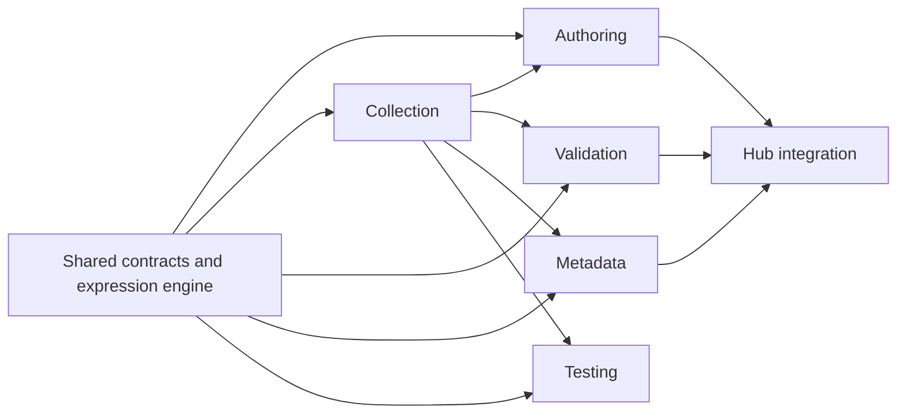

# Modular architecture

This repository follows the survey process. A **tool** owns one capability; a **package** is an importable implementation or contract. Folder location describes ownership, while `@mobilesurvey/*` names in `package.json` and `exports` define code connections. Moving folders does not change package names or the deployed URLs.

| Survey step | Owned code | Current user interface | Input → output |
| --- | --- | --- | --- |
| Questionnaire authoring | `tools/authoring/designer`, `tools/authoring/questionnaire-migrator` | Designer; Migrator screen in Hub | Source questionnaire or edits → `Instrument` |
| Data collection | `tools/collection/respondent`, `runtime-engine`, `respondent-view` | Respondent app; shared rendering in Designer | `Instrument` + answers → response and paradata |
| Data validation | `tools/validation/validation-engine` | Validator screen in Hub | `Instrument` + response data → findings, scores, corrections |
| Metadata discovery | `tools/metadata/metadata-registry`, `statcan-corpus` | Searcher and graph screens in Hub; corpus CLI | Instruments or corpus documents → searchable metadata |
| Published research use | `tools/research/researcher` | Researcher construction screen in Hub; local CLI | Source passages → reviewed publication-use candidates |
| Questionnaire testing | `tools/testing/questionnaire-bot` | CLI and HTML report | `Instrument` + respondent URL → paths, assertions, report |
| *Tabular mining & dissemination (Roadmap)* | `tools/analysis/remine` (`@mobilesurvey/remine`) | Analyzer screen in Hub; CLI | Multidimensional cubes / cross-tabs → fact briefs & bound articles |
| *Accessibility compliance (Roadmap)* | `tools/testing/a11y-auditor` | Bot CLI / Hub Validator & Designer | `Instrument` + DOM → WCAG 2.2 AA/AAA audit reports & certification |
| *Survey translation & harmonization (Roadmap)* | `tools/authoring/survey-translator` | Designer translation pane; CLI | Monolingual questions → StatCan-calibrated bilingual DDI (LoRA) |

`platform/hub` combines these tools with survey management, response monitoring, analysis, and CATI views. `platform/api` is the local SQLite fallback. Production persistence goes from browser apps to Supabase. The Hub currently owns the Validator, Searcher, Migrator, and Analyzer screens and their persistence adapters; those UIs have **not** been separated into standalone apps. Roadmap module specifications are detailed in `docs/roadmap-modular-tools.md`.

## Shared contracts and dependency direction

`packages/instrument-schema` is the common `Instrument` model. `packages/expression-engine` evaluates routing and edit expressions without `eval`. `packages/ddi-xml` serializes instruments to DDI-Lifecycle XML and JSON-LD. They are shared because more than one survey step uses them.



Each arrow points from a dependency to its consumer; this is the current package use, not a prescribed layering rule. For example, `metadata-registry` uses `runtime-engine`, and the Designer uses `respondent-view`. `statcan-corpus` is Node-only ETL and must not be imported into browser apps. The complete, machine-readable dependency graph is the `dependencies` and `exports` fields in each package's `package.json`; `pnpm-workspace.yaml` discovers `packages/*`, `platform/*`, and `tools/*/*`.

## Working on one tool

Run its package by its stable name, regardless of folder depth:

```bash
pnpm --filter @mobilesurvey/designer dev
pnpm --filter @mobilesurvey/runtime dev
pnpm --filter @mobilesurvey/questionnaire-bot test
pnpm --filter @mobilesurvey/statcan-corpus typecheck
pnpm test
pnpm typecheck
pnpm build
```

The three deployed apps remain at `/mobilesurvey/` (Hub), `/mobilesurvey/designer/`, and `/mobilesurvey/respondent/`. `.github/workflows/deploy.yml` builds them and copies their outputs from the new locations.

## Add a modular tool

1. Create `tools/<capability>/<package>/package.json` with a unique `@mobilesurvey/<name>`, `typecheck` and `test` scripts as appropriate, and explicit `exports`. Add an app beside it only if it needs a separate runtime or URL.
2. Depend on shared contracts through `workspace:*` package names. Export reusable rules from the tool package; put UI wiring and suite navigation in `platform/hub`. Avoid source-relative imports into another tool folder.
3. Define the interface in terms of `Instrument` and explicit input/output types. Use adapters for Supabase, local API, files, or external services so the package can run without the Hub.
4. If adding an app, add its build output to the deployment workflow and document its URL. Update this module map and `AGENTS.md` when ownership or dependency direction changes.
5. Run the package's tests and `pnpm typecheck` / `pnpm build`. Check `pnpm-lock.yaml` after adding a dependency.

## Extracting a tool later

Start with its `tools/<capability>/` folder plus the required shared `packages/` from its manifest. Preserve the `Instrument` contract or publish a versioned adapter. The collection app already has its own frontend, and the testing bot has a CLI. Validation, metadata discovery, and migration still have Hub-owned screens or adapters that must be moved or replaced for a complete standalone product. Keep the existing Supabase RLS and storage policies with any product that persists data.
