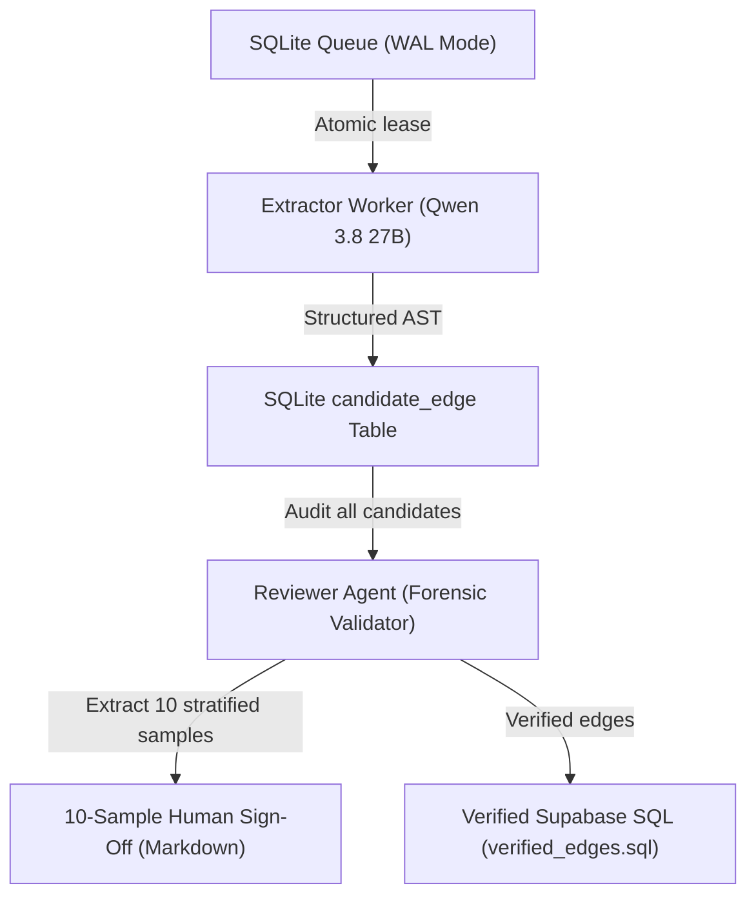

# Architectural Evaluation & Proposal: StatCan Metadata Repository

**Target Repository**: `/Users/pushp/Documents/Projects/mobilesurvey`  
**Date**: September 27, 2026  
**Status**: Consensus Architecture Plan (Reviewed & Aligned with Codex Second Opinion)  
**Domain**: Official Statistics Metadata (Statistics Canada / GSIM / DDI-Lifecycle 3.3 / DDI-CDI / W3C PROV-O)

**2026-09-30 capacity update:** The `halfvec(1024)` design below remains a retrieval experiment, not a deployment decision. Live storage and relevance findings in [Searcher vector audit](searcher-vector-audit.md) recommend lexical fixes first and a separate, rebuildable vector index if a judged pilot warrants it.

---

## 1. Executive Summary & Consensus Architecture

This document sets out the architecture for the national statistical metadata repository representing Statistics Canada (StatCan) survey instruments.

The dataset in `mobilesurvey/tools/metadata/statcan-corpus` encompasses **113+ surveys, 260+ cycles, and 438,931 variable occurrences** across major Canadian microdata collections (CCHS, LFS, CIS, LISA, Census, etc.).

### Consensus Architectural Decision
Following peer review and technical alignment with OpenAI Codex, we reject introducing external graph engines (e.g., Neo4j, Apache AGE, or archived engines like Kùzu) and un-deduplicated vector collections. Instead, the system adopts a **Tri-Layer Hybrid Architecture** built on battle-tested primitives:

1. **Relational Fact & Lineage Store (PostgreSQL / SQLite)**:
   - Retains immutable occurrences (`corpus_variable`) with JSONB category schemes.
   - Implements lineage as a dedicated, bidirectionally indexed `corpus_derivation_edge` adjacency table traversed via **bounded recursive CTEs with cycle prevention**.
2. **GSIM / DDI-Lifecycle 3.3 Variable Cascade**:
   - Maintains the conceptual hierarchy (`Concept` → `ConceptualVariable` → `RepresentedVariable` → `Variable`) in relational tables (`clusters.sql`).
3. **Bilingual Hybrid Search with Deduplicated Embeddings**:
   - Embeds **unique question and concept texts** deduplicated by content hash rather than raw occurrences, reducing vector storage by over 80%.
   - Combines PostgreSQL's existing `ts_rank_cd` full-text search with hosted `pgvector` (`halfvec`) via Reciprocal Rank Fusion (RRF), benchmarked against a bilingual baseline.
4. **Durable Local LLM Extraction Queue (Hermes)**:
   - A Node.js worker backed by SQLite in Write-Ahead Logging (`WAL`) mode with atomic job leasing, candidate validation against same-cycle variables, and strict JSON Schema output.
5. **Strict Provenance & Epistemic Transparency**:
   - Explicit two-compartment attribution separating official government documentation (under the Statistics Canada Open Licence) from synthesized AI derivations across schemas, API payloads, and UI badges.

## 2. The "Why": Strategic Value & Platform Capabilities Unlocked

Why are we extracting computational derivation trees and building this knowledge graph?

Currently, the repository is a **digital filing cabinet of 438,931 disconnected variable occurrences**. While text was successfully parsed from 3,000+ government PDFs, over **63,314 variables are calculated metrics** (e.g. Body Mass Index, Low Income Cut-offs, Depression Scores, Smoking Status) whose calculation formulas are trapped inside unstructured human text notes.

Transforming these unstructured paragraphs into a machine-readable, grounded knowledge graph unlocks four core platform capabilities for `mobilesurvey`:

### 2.1. One-Click Intelligent Questionnaire Assembly (The Designer)
- **Problem**: When a survey author in `@mobilesurvey/designer` wants to measure an official indicator (e.g., "Depression Scale" or "Physical Activity Index"), they currently must read a 400-page government PDF to manually determine which primary questions to include.
- **Solution**: With explicit `corpus_derivation_edge` links, an author selects a desired metric in the Designer's Library, and the system automatically imports the exact constituent questions (e.g., `ADL_01` through `ADL_05`) and their response choices into the questionnaire.

### 2.2. Interactive Lineage Flowcharts for Researchers & Analysts
- **Problem**: Data analysts working with StatCan microdata files have no way to visually trace how a column like `DAGEMTH` was constructed without manual footnote hunting.
- **Solution**: The Hub provides an interactive visual DAG (powered by `corpus_get_upstream_lineage()`) showing all upstream inputs, math operators, conditional branches, and population universes.

### 2.3. Automated Survey Response Validation
- **Problem**: `packages/validation-engine` needs to ensure respondent data is logically consistent and free of contradictions.
- **Solution**: Machine-readable derivation ASTs allow the validation engine to mathematically re-evaluate derived fields against base answers (e.g. verifying that a respondent's calculated `BMI` matches their reported height and weight) and flag data discrepancies automatically.

### 2.4. Creation of the First Machine-Readable Canadian Statistical Knowledge Graph
- Statistics Canada has never published an official, machine-readable computational lineage graph.
- Executing this pipeline locally on Apple Silicon leverages **zero-marginal-token costs** to transform 30 years of static government documentation into a fully interconnected, internationally compliant GSIM / DDI-Lifecycle 3.3 knowledge graph at zero API expense.

---

## 3. Problem Space & Corpus Characteristics

An audit of [`tools/metadata/statcan-corpus/out/knowledge-graph-summary.json`](file:///Users/pushp/Documents/Projects/mobilesurvey/tools/metadata/statcan-corpus/out/knowledge-graph-summary.json) and [`corpus.jsonl`](file:///Users/pushp/Documents/Projects/mobilesurvey/tools/metadata/statcan-corpus/out/corpus.jsonl) establishes the workload profile:

| Metric | Corpus Value | Architectural Implication |
|---|---|---|
| **Total Variables** | 438,931 occurrences | Fits entirely in unified memory; can be held in local SQLite/DuckDB or hosted Postgres. |
| **Total Surveys & Cycles** | 113 surveys, 260 cycles | Needs hierarchical grouping: `StudyGroup` → `Study` (Cycle) → `ContentModule` → `Variable`. |
| **Collected Variables** | 354,683 | Directly mapped to respondent questions; require bilingual full-text and semantic search. |
| **Derived Variables** | 48,508 (47,127 role + recodes) | Need computational provenance (`wasDerivedFrom`) tracing back to base variables. |
| **PUMF Collapsed Groups** | 15,134 | Require representations that distinguish master file granularity from public-use files. |
| **Language Strategy** | English-only live corpus by design | Supabase holds English occurrences (`languages: ['en']`). The local extraction queue can contain bilingual record IDs; publication resolves each link to English target and source occurrences in the same document. French records are intentionally excluded from the live corpus. |

---

## 4. Technology Evaluation Matrix

| Requirement / Dimension | Pure Vector DB (Qdrant/Chroma) | External Graph DB (Neo4j/AGE) | Pure Relational (Flat Postgres) | Consensus Hybrid Architecture |
|---|---|---|---|---|
| **Exact Mnemonic / Code Lookup** (`DHHGAGE`, `LFS_01`) | ❌ Poor | ⚠️ Moderate | ✅ Instant B-Tree | ✅ Relational PK + `pg_trgm` |
| **Codebook Category Integrity** | ❌ Unusable | ⚠️ High node bloat | ✅ Fast JSONB column | ✅ JSONB on immutable occurrences |
| **Lineage & Derivation Traversal** | ❌ None | ✅ Cypher / SPARQL | ⚠️ Complex joins | ✅ Bounded recursive CTEs with cycle detection |
| **Cross-Cycle Harmonization** | ⚠️ Fuzzy only | ✅ Native | ⚠️ Multi-table joins | ✅ GSIM Variable Cascade (`clusters.sql`) |
| **Bilingual Semantic Discovery** | ✅ Native (multilingual) | ❌ Poor | ⚠️ Lexical only | ✅ Fusion: `ts_rank_cd` + Deduplicated `halfvec` |
| **Operational & Hosting Overhead** | ⚠️ Extra service | ❌ JVM / extension maintenance | ✅ Zero | ✅ Standard Postgres / SQLite WAL |

---

## 5. Detailed Component Design

### 5.1. Relational Fact & Lineage Store

#### A. Immutable Occurrences (`corpus_variable`)
Defined in [`sql/schema.sql`](file:///Users/pushp/Documents/Projects/mobilesurvey/tools/metadata/statcan-corpus/sql/schema.sql). Holds raw data dictionary facts. The code list is stored directly in `codes jsonb` to eliminate ~2 million child table joins.

#### B. Explicit Lineage Adjacency Table (`corpus_derivation_edge`)
To be applied in `sql/derivation_edges.sql`:
```sql
create table if not exists corpus_derivation_edge (
  edge_id               uuid primary key default gen_random_uuid(),
  target_record_id      uuid not null references corpus_variable(record_id),
  source_record_id      uuid references corpus_variable(record_id), -- null if external/master file
  source_var_name       text not null,
  survey_group          text not null,
  cycle                 text not null,
  
  -- Epistemic Authority & Attribution
  data_authority        text not null default 'ai_inferred'
    check (data_authority in ('official_statcan', 'ai_inferred', 'human_verified')),
  ai_model              text default 'qwen3.8-27b',
  ai_auditor            text default 'reviewer_agent_v1',
  confidence            real not null default 1.0,
  review_status         text not null default 'candidate', -- 'candidate', 'verified', 'needs_review', 'rejected'
  
  -- Derivation Logic & Summaries (AI Inferred)
  derivation_type       text not null default 'formula', -- 'formula', 'recode', 'collapse', 'imputation'
  ai_expression_summary text,
  ai_logic_ast          jsonb,
  
  -- Official StatCan Source Evidence (Immutable Facts)
  statcan_verbatim_note text not null,
  statcan_citation      jsonb, -- { "doc": "...", "page": 42, "licence": "Statistics Canada Open Licence" }
  
  created_at            timestamptz not null default now()
);

-- Bidirectional indexes for forward and backward provenance queries
create index if not exists idx_derivation_target on corpus_derivation_edge (target_record_id, review_status);
create index if not exists idx_derivation_source on corpus_derivation_edge (source_record_id, review_status);
create index if not exists idx_derivation_cycle  on corpus_derivation_edge (survey_group, cycle);
create unique index if not exists idx_derivation_target_source_name_unique
  on corpus_derivation_edge (target_record_id, (upper(btrim(source_var_name))));
```

#### C. Bounded Recursive Lineage CTE with Cycle Prevention
```sql
with recursive lineage as (
  -- Anchor member: immediate inputs
  select 
    target_record_id, 
    source_record_id, 
    source_var_name,
    ai_expression_summary,
    data_authority,
    1 as depth,
    array[target_record_id] as path
  from corpus_derivation_edge
  where target_record_id = :root_record_id
    and review_status = 'verified'

  union all

  -- Recursive member: trace upstream
  select 
    e.target_record_id, 
    e.source_record_id, 
    e.source_var_name,
    e.ai_expression_summary,
    e.data_authority,
    l.depth + 1,
    l.path || e.target_record_id
  from corpus_derivation_edge e
  join lineage l on e.target_record_id = l.source_record_id
  where l.depth < 5
    and not (e.target_record_id = any(l.path)) -- Cycle detection
    and e.review_status = 'verified'
)
select * from lineage;
```

---

### 5.2. Deduplicated Bilingual Vector Architecture

Rather than embedding 438,931 raw variable occurrences (which creates massive redundancy and costs ~1.67 GiB in float32), embeddings are deduplicated at the **text content level**:

1. **Text Normalization**:
   Canonical text representation:
   ```
   [Concept]: {concept_label} | [Question]: {question_text} | [Categories]: {category_labels.join(', ')}
   ```
2. **Versioned Embedding Table**:
   ```sql
   create table if not exists corpus_embedding (
     text_hash   text primary key, -- sha256(lang || ':' || normalized_text)
     lang        text not null,
     model       text not null,    -- 'bge-m3:v1'
     dim         integer not null, -- 1024
     embedding   halfvec(1024) not null,
     created_at  timestamptz not null default now()
   );

   -- Mapping table between variable occurrences and embeddings
   create table if not exists corpus_variable_embedding (
     record_id   uuid primary key references corpus_variable(record_id),
     text_hash   text not null references corpus_embedding(text_hash)
   );

   create index if not exists idx_cve_hash on corpus_variable_embedding (text_hash);
   ```
3. **Retrieval Fusion**:
   Benchmark PostgreSQL's existing `ts_rank_cd(fts, query)` against vector cosine similarity using Reciprocal Rank Fusion (RRF):
   $$\text{RRF}(d) = \frac{1}{60 + \text{rank}_{\text{fts}}(d)} + \frac{1}{60 + \text{rank}_{\text{vec}}(d)}$$

---

### 5.3. Offline LLM Extraction & Review Pipeline (Hermes)

To process the ~48,508 derived variables safely without brittle batching or unverified cloud writes:



1. **Extractor Worker**: Runs locally via `qwen3.8-27b` using native JSON Schema (`response_format: { type: "json_schema" }`) to output structured dependency lists.
2. **Reviewer Agent (`src/graph/reviewer.ts`)**:
   - **Range Expansion**: Identifies alphanumeric range patterns (e.g. `C13A to C13X` in English and French, `E14A to E28A`).
   - **Grounding & Existence**: Validates that extracted variables actually resolve to real dataset columns in that survey year.
   - **Stratified Human Sign-off**: Automatically emits a 10-item markdown review file (`out/human_review_sample_10.md`).
   - **Supabase Exporter**: Generates idempotent SQL migrations (`out/verified_edges.sql`).

---

## 6. Provenance, Attribution & Epistemic Transparency

To guarantee research integrity and transparency under the **Statistics Canada Open Licence**, users must never wonder whether a definition came from an official government statistician or an automated AI pipeline.

### 6.1. The "Two-Compartment" API Response Model
All API endpoints and JSON-LD exports project metadata into two distinct top-level namespaces:

```json
{
  "record_id": "b23cae39-1488-5fcb-98eb-3adf22c78cf9",
  "variable_name": "DAGEMTH",
  
  "statcan_official": {
    "question_text": null,
    "universe": "Respondents aged 15+",
    "documentation_note": "Derived based on A02 - it is the difference in months between A02 and 31 October 2006 (rounded down).",
    "categories": [
      { "code": "996", "label": "Valid skip" },
      { "code": "999", "label": "Not stated" }
    ],
    "provenance": {
      "survey_group": "ACS_EEA_2006",
      "cycle": "2006",
      "document": "acs_eea_2006_pumf.pdf",
      "page": 38,
      "tcode": "T15.2",
      "licence": "Statistics Canada Open Licence"
    }
  },

  "ai_inferred_lineage": {
    "is_synthetic": true,
    "data_authority": "ai_inferred",
    "derivation_type": "formula",
    "source_variables": ["A02"],
    "summary": "DAGEMTH is calculated as the integer month difference between A02 and October 31, 2006.",
    "model_attribution": {
      "model": "qwen3.8-27b",
      "auditor": "reviewer_agent_v1",
      "confidence": 0.95,
      "review_status": "verified",
      "generated_at": "2026-09-28T01:12:55Z"
    }
  }
}
```

### 6.2. UI/UX Trust & Visual Separation
1. **Color-Coded Status Badges**:
   - 🏛️ **Green Pill (`StatCan Official`)**: Rendered on question wording, official variable names, category tables, universes, and PDF page citations.
   - ✨ **Purple Pill (`AI Inferred`)**: Rendered on computational derivation DAGs, cross-cycle harmonization timelines, and formula summaries.
2. **The "StatCan Receipt" Drawer (Side-by-Side Verification)**:
   - Clicking on any AI-inferred derivation formula or link opens a slide-over drawer displaying:
     - The verbatim text snippet extracted from the PDF.
     - The exact PDF filename, survey cycle, and page number.
     - An explicit disclaimer: *"This derivation link was extracted by local AI and verified against the published dataset schema. It was not directly codified by Statistics Canada."*

### 6.3. W3C PROV-O & DDI-CDI Ontology Compliance
When exporting metadata to semantic formats (JSON-LD / RDF / DDI-CDI):
- `prov:wasDerivedFrom`: Links the target variable to the source variable.
- `prov:wasAttributedTo`: Explicitly declares `:mobilesurvey-ai-agent` rather than `:StatisticsCanada`.
- `prov:hadPrimarySource`: Directly points to the official StatCan documentation asset URI.

---

## 7. Phased Implementation Roadmap

### Phase 1: Derivation Edge Schema & Recursive Query Benchmark
- Apply `derivation_edges.sql` in Postgres/Supabase.
- Run `EXPLAIN (ANALYZE, BUFFERS)` on 1, 3, and 5-hop recursive queries using existing rule-based extraction data (12,210 records).
- Measure query latency to confirm sub-50ms response times for UI tree views.

### Phase 2: Offline SQLite WAL Queue & Reviewer Pilot (Completed)
- ✅ Seeded `queue.db` with 500 derived variables.
- ✅ Extracted 1,285 candidate edges via local `qwen3.8-27b`.
- ✅ Audited with Reviewer Agent: 965 verified clean, 320 flagged for master file review, 0 hallucinations.
- ✅ Generated stratified 10-item human review sample (`out/human_review_sample_10.md`).
- ✅ Exported 965 verified edges to `out/verified_edges.sql`.

### Phase 3: Bilingual Embedding Deduplication & Search Evaluation
- Extract unique question and concept texts across English and French corpora.
- Generate embeddings using local `BAAI/bge-m3` or `multilingual-e5-base`.
- Benchmark retrieval accuracy on 50 representative bilingual queries:
  1. Pure `ts_rank_cd` (baseline)
  2. Pure Vector Search
  3. Reciprocal Rank Fusion (RRF)
- Promote vector fusion to the default searcher route in Hub if retrieval gains are demonstrated.
