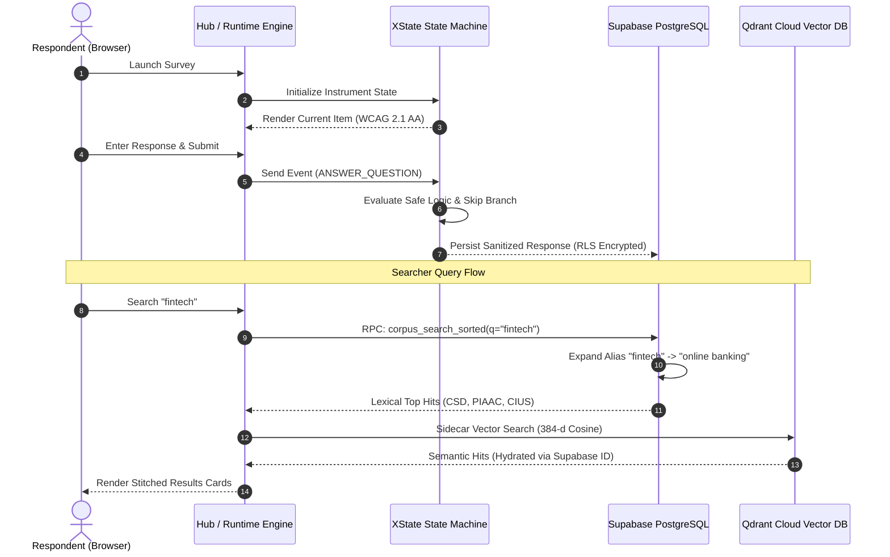

# 01 — Modular Tools Architecture

> **Architectural contracts, package boundaries, data flows, and runtime isolation across the mobilesurvey ecosystem.**

---

## 1. System Decomposition & Boundaries

The codebase is organized as a high-discipline **pnpm monorepo** with strict architectural separation between **core contracts** (`packages/`), **autonomous tools** (`tools/`), and **integration surfaces** (`platform/`):

```
mobilesurvey/
├── packages/                    # Immutable Shared Contracts
│   ├── instrument-schema        # DDI-aligned JSON Instrument specification (Zod + TS)
│   ├── expression-engine        # Safe, eval-free math & logic evaluator (AST parser)
│   └── ddi-xml                  # DDI-Lifecycle 3.3 XML / JSON-LD serialization
├── tools/                       # Decoupled Domain Capabilities
│   ├── authoring/               # Designer application & StatCan EQ migrator
│   ├── collection/              # Runtime State Machine (XState v5) & Respondent UI
│   ├── testing/                 # Questionnaire Testing Bot (Chromium path execution)
│   ├── validation/              # Multi-tier survey data validation engine
│   ├── metadata/                # 438k StatCan corpus ETL, DAG lineage & vector sidecar
│   └── research/                # Outside academic & policy publication discovery
└── platform/                    # Public Integration Shells
    ├── hub                      # Vite SPA combining Suite Hub, Searcher, and Researcher
    └── api                      # Local Hono/SQLite dev fallback (Supabase in prod)
```

### Absolute Boundary Rules
1. **No Circular or Source-Relative Tool Imports**: Tools never import from each other via relative paths (`../../tools/...`). Integration occurs exclusively through shared contracts in `packages/` or via public RPCs.
2. **Eval-Free Runtime Guarantee**: The expression engine (`@mobilesurvey/expression-engine`) parses logic trees into an AST and evaluates them against an immutable whitelist of operators and functions. No `eval()` or `Function()` constructs exist in the codebase.
3. **Double-Blind Storage Separation**: Demo exploration questionnaires (e.g. Labour Force Survey `lfs`) run on local mock stores and **never** persist to Supabase; only live collection instruments persist.

---

## 2. Pillar Deep-Dive

### Pillar 1: Authoring & Migration (`tools/authoring`)
* **Designer (`tools/authoring/designer`)**: A visual drag-and-drop questionnaire builder supporting branching rules, dynamic text piping, response domain constraints, and live preview rendering.
* **Migrator (`tools/authoring/questionnaire-migrator`)**: Automatically ingests legacy Statistics Canada Electronic Questionnaire (EQ) specification files, parses complex battery grids, and outputs canonical `Instrument` JSON while warning on unsupported agency constructs rather than guessing.

### Pillar 2: Survey Collection Engine (`tools/collection`)
* **Runtime Engine (`tools/collection/runtime-engine`)**: Built on **XState v5**, providing a deterministic finite state machine that coordinates:
  - Sequence navigation and skip logic evaluation.
  - Variable scoping (root vs. roster loops).
  - Paradata audit trails (focus loss, latency per question, revision counts).
* **Respondent View (`tools/collection/respondent-view`)**: High-performance, mobile-first React UI meeting **WCAG 2.1 AA** standards with full keyboard trap avoidance, high contrast modes, and dynamic screen-reader live regions.
* **Sensor Module**: Pluggable consent-gated response domains (`geolocation` and `photo` recognition) with client-side EXIF scrubbing, precision degradation controls, and paradata audit logging.

### Pillar 3: Multi-Method Validation (`tools/validation`)
* Implements a tri-stage data cleaning and confrontation pipeline:
  1. **Deterministic Rule Engine**: Instant range checks, skip-logic violations, and arithmetic consistency (e.g., total income vs components).
  2. **Statistical Anomaly Detection**: Distributional outlier scoring, benford law tests, and multivariate cross-checks.
  3. **LLM-Assisted Resolution**: Non-destructive resolution suggestions that leave original microdata untouched while proposing weighted re-allocations.

### Pillar 4: Autonomous Testing Bot (`tools/testing/questionnaire-bot`)
* Autonomous headless Chromium runner that crawls survey logic trees before field deployment:
  - **Path Enumeration Strategies**: All-paths, boundary-value, and random-walk crawlers.
  - **Consent Branch Testing**: Automatically detects and asserts against consent traps (e.g. required sensor without a refusal branch).
  - **HTML Test Reports**: Produces step-by-step visual audit logs and trace recordings.

### Pillar 5: Metadata Corpus & Knowledge Graph (`tools/metadata/statcan-corpus`)
* Full-corpus census covering **438,931 variables** across **113 survey programs** and **260 cycles**:
  - **GSIM 2D Taxonomy**: Formal classification across Data Origin (`collected`, `derived`, `process`, `administrative`) and Computation Status.
  - **W3C PROV-O Derivation DAG**: Lineage mapping linking derived variables back to their raw collected counterparts (`prov:wasDerivedFrom`).
  - **Hybrid Search Engine**: Field-aware Postgres Full-Text Search combined with a Qdrant Cloud dense vector sidecar for semantic discovery.

### Pillar 6: Empirical Researcher (`tools/research/researcher`)
* Bridges official statistical agency metadata with external academic and public policy evidence:
  - Catalogues **326 verified outside publications** (peer-reviewed articles, provincial health reports, NGO policy studies) analyzing Canadian survey microdata.
  - Enforces strict Canadian grounding (`isCanadianGrounded`) and foreign statistical agency disqualification (`hasForeignDisqualifier`).
  - Deep-links directly from outside research evidence cards into Searcher variable queries.

---

## 3. Data Flow Architecture



---

## 4. Persistence Architecture: Local Dev vs Production

| Feature | Local Development Mode | Production Deployment |
| :--- | :--- | :--- |
| **Persistence Layer** | Local Hono REST API + `node:sqlite` WAL | Supabase PostgreSQL + Row-Level Security (RLS) |
| **Vector Engine** | In-Memory / Local Transformers | Qdrant Cloud (`modularsurvey` cluster) |
| **Hosting** | Localhost (Vite dev server) | Custom Domain (`msurvey.peji.ca`) on GitHub Pages via Cloudflare DNS |
| **Security Model** | Ephemeral local tokens | Strict PostgreSQL RLS policies; zero public secret exposure |
| **Data Integrity** | In-memory mock dictionaries | Foreign key lineage DAG, unique sha256 dedupe keys |
