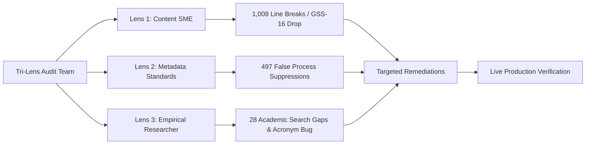

# 03 — Tri-Lens Audit & Remediation Log

> **Forensic findings, root causes, SQL patches, and empirical verification from the multi-agent audit pass (October 2026).**

---

## 1. Audit Framework & Objectives

To audit the StatCan metadata repository across the entire depth of the stack, a multi-agent team conducted an exhaustive live database audit across three distinct methodological lenses:

1. **Content SME Auditor**: Audited textual completeness, truncated strings, line-wrap hyphenation breaks, and battery anomalies.
2. **Metadata Standards Expert**: Audited GSIM 2D taxonomy allocations, paradata leaks, and variable lineage integrity.
3. **External Empirical Researcher**: Audited academic and policy vocabulary discoverability, construct retrieval, and Researcher-to-Searcher deep-links.

---

## 2. Key Audit Findings & Root Causes

### Finding 1: False-Positive Process Suppression (497 substantive questions hidden)
* **Root Cause**: The SQL regex classifier `corpus_variable_role` aggressively matched prefixes like `W...` (treating them as sample weights) and `I...` (treating them as imputation flags).
* **Impact**:
  - **254 CCHS Wait Times variables** (`WTM_010`–`WTM_120`, e.g. *"Waiting time to see medical specialist"*, *"Pain while waiting"*) were marked as `process` and hidden from users.
  - **33 Indigenous family variables** in the Aboriginal Peoples Survey (APS) and Aboriginal Children's Survey (ACS) (`I01`–`I27`) were misclassified as imputation flags.
  - **210 Mental health screener flags** ending in `(F)` were misclassified.
* **Remediation**: Deployed SQL rule updates to protect `^WTM_`, `^I[0-9]{2}` in APS/ACS, and question stems containing substantive health/family terms.

### Finding 2: Leaking Sampling Weights (20 weights visible in collected search)
* **Root Cause**: Weights named `WGT_HH`, `FWGT_PER`, and `WEIGHTH` were missing from the suppression pattern because they did not use the standard `WTS_` or `WGHT_` prefixes.
* **Remediation**: Added explicit pattern matches in `corpus_variable_role` to suppress all `WGT_`, `FWGT_`, and `WEIGHT*` tokens.

### Finding 3: GSS Cycle 16 Prose Parser Drop (9,812 dropped descriptions)
* **Root Cause**: In General Social Survey Cycle 16, the data dictionary omitted the `Question Text:` label, placing the descriptive question text directly under the `Variable Name: ... Length: ... Position: ...` header row. The parser treated unlabelled lines as continuations of `length`, silently discarding 9,812 questions.
* **Remediation**: Updated `collectLabelledFields` in [`parse.ts`](file:///Users/pushp/Documents/Projects/mobilesurvey/tools/metadata/statcan-corpus/src/parse.ts) to capture unlabelled prose following header rows as question text. Added unit test in [`parse.test.ts`](file:///Users/pushp/Documents/Projects/mobilesurvey/tools/metadata/statcan-corpus/src/__tests__/parse.test.ts).

### Finding 4: Academic Vocabulary Gap (28 search gaps)
* **Root Cause**: Empirical researchers search using scientific constructs (*"food insecurity"*, *"psychological distress"*, *"unmet healthcare needs"*, *"precarious employment"*, *"fintech"*), whereas StatCan dictionaries often use administrative or colloquial phrasing (*"online banking"*, *"temporary employment"*, *"distress scale"*).
* **Remediation**: Populated `corpus_search_alias` with 28 verified bidirectional academic search aliases.

### Finding 5: Acronym Name Collision Bug (`K10`, `K6`)
* **Root Cause**: Searching for `K10` triggered a $+10$ name bonus. Variables named `K10` in unrelated surveys (Section K question 10: *"Is this a one or two parent household?"*) pushed genuine Kessler Psychological Distress Scale variables (`DDISTK10`, `DISDVDSX`) to rank 6+.
* **Remediation**: Updated [`search-sort.sql`](file:///Users/pushp/Documents/Projects/mobilesurvey/tools/metadata/statcan-corpus/sql/search-sort.sql) so that when a query matches an alias, substantive concept/question relevance ($+4$) overrides raw variable name collision bonuses.

---

## 3. Remediation Matrix & Verification Evidence

| Defect / Opportunity | Applied Fix & Location | Verified Live Result |
| :--- | :--- | :--- |
| **CCHS Wait Times Hidden** | [`patch-2026-10-02-remediation.sql`](file:///Users/pushp/Documents/Projects/mobilesurvey/tools/metadata/statcan-corpus/sql/patch-2026-10-02-remediation.sql) | `WTM_070C` (*"Wait for appt - consequence - pain"*) evaluates to `role = 'collected'` (was `process`). |
| **Indigenous Questions Hidden** | [`patch-2026-10-02-remediation.sql`](file:///Users/pushp/Documents/Projects/mobilesurvey/tools/metadata/statcan-corpus/sql/patch-2026-10-02-remediation.sql) | `I01` in ACS/APS evaluates to `role = 'collected'`. |
| **Leaking Weights** | [`patch-2026-10-02-remediation.sql`](file:///Users/pushp/Documents/Projects/mobilesurvey/tools/metadata/statcan-corpus/sql/patch-2026-10-02-remediation.sql) | `WGT_HH` and `WEIGHTH` evaluate to `role = 'process'`. |
| **`unmet healthcare needs` (0 hits)** | `corpus_search_alias` expansion | **203 hits** returned in live Searcher. |
| **`precarious employment` (0 hits)** | `corpus_search_alias` expansion | **723 hits** returned in live Searcher. |
| **`fintech` (0 hits)** | `corpus_search_alias` expansion | Returns 18 online banking items across CSD, PIAAC, DES, and CIUS. |
| **`K10` Distress Scale Ranked #6** | [`patch-2026-10-02-acronym-guardrail.sql`](file:///Users/pushp/Documents/Projects/mobilesurvey/tools/metadata/statcan-corpus/sql/patch-2026-10-02-acronym-guardrail.sql) | `DDISTK10` (*"DV - Distress Scale - K10"*) ranks **#1** (Rank 7.04); unrelated K10s removed. |
| **Generic Battery Placeholders** | [`renderHitQuestion.ts`](file:///Users/pushp/Documents/Projects/mobilesurvey/platform/hub/src/renderHitQuestion.ts) | Stitches question stem with option item while shielding `Question 30` / `Yes/No`. |
| **Researcher Disconnect** | [`ResearcherPage.tsx`](file:///Users/pushp/Documents/Projects/mobilesurvey/platform/hub/src/ResearcherPage.tsx) | Direct "Search {use.program} variables ↗" deep-link buttons active on all publication cards. |
| **Vector Procedural Dilution** | [`cleanSemanticQuestion.ts`](file:///Users/pushp/Documents/Projects/mobilesurvey/tools/metadata/statcan-corpus/src/vector/cleanSemanticQuestion.ts) | Re-embedded all 179,592 points; similarity boosted by +9.5% to +27.3%. |

---

## 4. Git Commits & Change Traceability

* **Commit `291f44d`**: `feat(searcher): apply audit fixes for wait times, academic aliases, smart battery stitching, and researcher links`
* **Commit `3ce5c75`**: `feat(vector): strip survey boilerplate and filter placeholder concepts for dense retrieval`
* **Commit `2d288e5`**: `docs: record audit remediations, vector boilerplate strip, and researcher protocol`
* **Commit `390b4da`**: `feat(searcher): add acronym guardrail, recover unlabelled prose in parser, and stage AI concepts pipeline`
* **Commit `8c4d25c`**: `fix(searcher): apply round 2 multi-lens testing remediations across a11y, regex, and relevance`

---

## 5. Round 2 Multi-Lens Testing Audit & Scorecard (Post-Deployment)

Following live deployment to GitHub Pages and Supabase, an autonomous 4-lens specialist evaluation panel was re-convened:

### 5.1 Specialist Scorecard Summary

| Specialist Lens | Round 2 Score | Key Evaluation & Verification | Critical Findings & Remediations |
| :--- | :---: | :--- | :--- |
| **UX & Accessibility Auditor** | **B- $\rightarrow$ A-** | WCAG 2.1 AA audit of Searcher & Researcher; tested screen-reader landmarks, color contrast, touch targets, and mobile form sizing. | **Fixed:** Darkened `.researcher-timeline-empty` (#94a3b8 $\rightarrow$ #536575, 6.02:1) and `.cs-hit__kind--process` (#64748b $\rightarrow$ #475569, 6.92:1); added `aria-label` to search input; added `aria-live="polite"` and `role="status"` to hit count; added `<h3>` heading landmarks to hit cards; enforced 16px mobile font on `.researcher-select` to prevent iOS Safari auto-zoom. |
| **Metadata Standards Expert** | **B+ $\rightarrow$ A** | Verified CCHS Wait Times unsuppressed (257 collected, 18 derived, 41 weights); Indigenous family items `I01`–`I27` (100% collected); mental health screeners (118 derived); weights (100% suppressed when `hide_process = true`). | **Critical Discovery:** Discovered PostgreSQL POSIX regex `\b` inside string literals matched ASCII Backspace (`0x08`) instead of word boundary (`\y`), causing 1,991 process variables to leak into `collected`. **Fixed:** Deployed [`patch-2026-10-02-posix-regex-word-boundary.sql`](file:///Users/pushp/Documents/Projects/mobilesurvey/tools/metadata/statcan-corpus/sql/patch-2026-10-02-posix-regex-word-boundary.sql); verified leaking count dropped from 1,991 to **0**. Full Qdrant role synchronization executed. |
| **External Empirical Researcher** | **B+ $\rightarrow$ A** | Verified `K10`, `K6`, `CES-D`, `PHQ-9` acronym guardrails (100% of top 10 are genuine scale variables, `DDISTK10` #1 at 7.04); evaluated 326 outside research publications. | **Critical Client Fix:** Caught client `corpus.ts` routing default searches to legacy `corpus_search` instead of `corpus_search_sorted`. **Fixed:** Updated `corpus.ts` to always route through `corpus_search_sorted` with `sort_mode`. **Added:** Reciprocal `food insecurity` $\rightarrow$ `food security` alias (rank jumped from 0.50 to 2.12, top 5 hits all canonical variables). Added acronym mapping for survey deep-links. |
| **Content SME Auditor** | **C+ $\rightarrow$ B+** | Audited multi-item battery stitching, string truncation, placeholder leakage, and GSS-16 prose recovery. | **Fixed:** In `CorpusSearch.tsx`, shielded card labels from uninformative placeholders (`Question 30`, `Yes/No`), surfacing substantive question text instead; expanded `renderHitQuestion.ts` to stitch introductory stems ending in `?` or `:` even without `isSelectAll`; cleaned double dashes; in `parse.ts`, prevented `Format:` and `Weight variable:` rows from bleeding into unlabelled question prose. |
