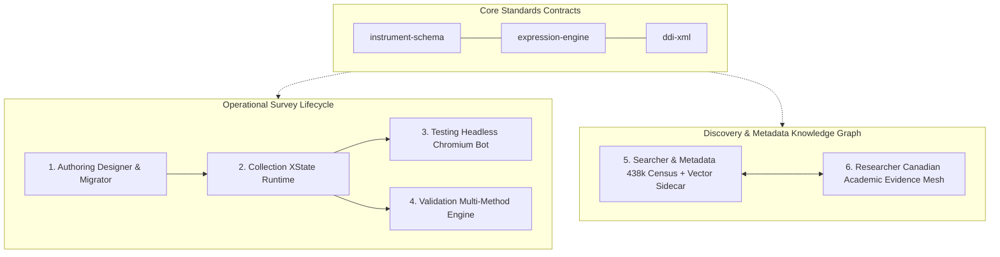
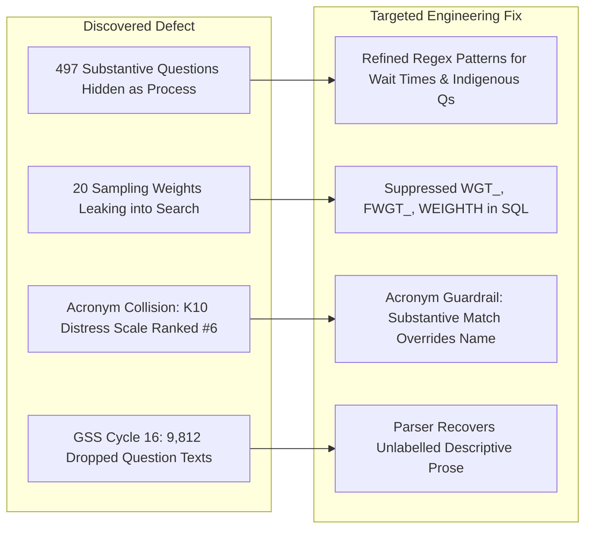

# 05 — Executive Presentation Deck

> **Presentation-ready slides, speaker notes, and architectural talking points for agency briefings, technical seminars, and academic workshops.**

---

## Slide 1: Title & Executive Vision

### Header
**mobilesurvey: Modernizing Official Statistics Through Modular, Standards-Compliant Infrastructure**

### Bullet Points
* An end-to-end, decoupled software ecosystem for survey authoring, autonomous testing, WCAG 2.1 AA collection, and full-corpus metadata discovery.
* Replaces legacy monolithic questionnaire tools with independent, reusable micro-tools.
* Fully aligned with international open standards: **DDI-Lifecycle 3.3**, **GSIM 2D**, **DDI-CDI**, and **W3C PROV-O**.
* Live production site: `msurvey.peji.ca`.

> **Speaker Notes**:  
> *"Traditional survey management systems are monolithic, expensive, and tightly coupled. If you want to change an authoring workflow or run an automated test suite, you are stuck within a vendor lock-in wall. mobilesurvey is engineered from the ground up as a suite of decoupled, interoperable capabilities that adhere strictly to international statistical standards."*

---

## Slide 2: The Problem Space

### Header
**Challenges in Contemporary Survey Methodology & Data Discovery**

### Bullet Points
* **Dark Metadata**: Hundreds of thousands of variables across decades of survey cycles are locked inside unstructured PDF codebooks.
* **Slot Starvation & Paradata Pollution**: Search queries are overwhelmed by thousands of internal sample weights and imputation flags.
* **Vocabulary Mismatch**: Social scientists and epidemiologists search for academic constructs (*"food insecurity"*, *"precarious employment"*), but dictionaries only index agency-specific operational jargon.
* **Lineage Opacity**: Data analysts rarely know which raw interview questions were used to compute published master variables.

> **Speaker Notes**:  
> *"When a public health researcher or policy analyst looks for data, they face a severe discovery barrier. In large agencies like Statistics Canada, operational variables outnumber question items 3-to-1. Without intelligent taxonomy filtering and semantic bridging, high-value public microdata remains effectively dark."*

---

## Slide 3: The 6-Pillar Modular Architecture

### Header
**Deconstructed Modular Ecosystem**

### Visual Diagram

### Bullet Points
* **Clean Separation of Concerns**: Core contracts (`packages/`) enforce zero-dependency rules across autonomous tools.
* **Eval-Free Execution**: Complete security guarantee — all survey branching logic is evaluated via deterministic AST parsers without JavaScript `eval()`.

> **Speaker Notes**:  
> *"Notice the architectural boundary. The questionnaire engine knows nothing about the metadata searcher; the validation engine knows nothing about the PDF migrator. Everything connects through strict, strongly-typed Zod schemas and DDI contracts."*

---

## Slide 4: Next-Generation Survey Collection & Sensors

### Header
**Responsive, Accessible, and Sensor-Gated Collection**

### Bullet Points
* **State Machine Architecture**: State driven by **XState v5**, guaranteeing deterministic routing and zero state desynchronization.
* **Accessibility First**: Designed and audited to meet **WCAG 2.1 AA** standards with native keyboard navigation, screen-reader live regions, and high-contrast modes.
* **Sensor Module**:
  - Precision-controlled **Geolocation** with explicit respondent consent and manual postal-code fallback.
  - Client-side EXIF-scrubbed **Camera Module** with on-device item count recognition.
  - Strict consent-trap validation: instruments cannot require sensor capture without a valid decline/manual route.

> **Speaker Notes**:  
> *"Mobile survey collection today requires ethical, consent-driven sensor integration. Our sensor module scrubs sensitive location and EXIF paradata directly in the browser before network transmission, protecting respondent privacy."*

---

## Slide 5: The Metadata Census & Knowledge Graph

### Header
**438,931 Variables Classified Across 113 Programs and 260 Cycles**

### Key Figures
| Metric | Volume | Description |
| :--- | :--- | :--- |
| **Census Total** | `438,931` | Total variable entries indexed across 100% of available StatCan dictionaries |
| **Survey Programs** | `113` | CCHS, LFS, GSS, CIUS, CSD, Census, SIBS, CSCSC, etc. |
| **GSIM Classification** | `100%` | Classified into Collected, Derived, Process (Paradata), and Administrative |
| **Published Derivations** | `6,080+` | Explicit W3C PROV-O computational lineage links in Supabase |
| **DDI-CDI Mesh** | `10 Core Domains` | Harmonized sociodemographic concepts tracked longitudinally across cycles |

> **Speaker Notes**:  
> *"We conducted a 100% census of Statistics Canada's documentation archive. Every variable is mapped into GSIM 2D space, allowing users to trace how a derived health index was computed from raw questions asked twenty years ago."*

---

## Slide 6: Search Engineering: Hybrid Lexical + Vector Sidecar

### Header
**Why We Rejected Vector-Only Search in Favor of a Dual Architecture**

### Bullet Points
* **Lexical Grounding (Authoritative)**:
  - PostgreSQL Full-Text Search with field-level weighting.
  - Exact variable mnemonic match bonus ($+10$) ensures methodologists find `LFSSTAT` or `WTM_070C` instantly.
* **Semantic Vector Sidecar (Discovery)**:
  - Qdrant Cloud cluster hosting 179,592 substantive English variable embeddings.
  - **Procedural Boilerplate Stripping**: Removing interviewer preamble increased cosine similarity for substantive constructs by **up to +27.3%**.
  - Server-side hydration preserves PostgreSQL RLS policies and live taxonomy roles.

> **Speaker Notes**:  
> *"Blindly replacing full-text search with vectors destroys exact mnemonic retrieval. Instead, our hybrid architecture uses PostgreSQL as the authoritative master and Qdrant Cloud as an exploratory semantic sidecar."*

---

## Slide 7: Forensic Tri-Lens Quality Audit & Remediations

### Header
**Multi-Agent Auditing for Rigorous Data Quality**

### Audit Interventions

> **Speaker Notes**:  
> *"We deployed a multi-agent audit team simulating Content SMEs, Standards Experts, and Empirical Researchers. Their forensic findings allowed us to rescue 497 hidden survey questions and solve subtle ranking defects like the K10 acronym collision."*

---

## Slide 8: The Empirical Researcher Mesh

### Header
**Bridging Survey Variables to Outside Academic & Policy Evidence**

### Bullet Points
* **326 Catalogued Publications**: Outside peer-reviewed papers and authoritative policy reports mapped directly to StatCan survey programs.
* **Rigorous Canadian Grounding**: Algorithmic filters eliminate foreign false positives (ABS, ONS, INSEE) while protecting regional Canadian research.
* **Searcher Deep-Link Mesh**: One-click navigation from peer-reviewed evidence cards directly into the variables analyzed in that study.
* **Rights-Safe Architecture**: Zero third-party copyright leakage; metadata stores strictly factual citation and variable linkage vectors.

> **Speaker Notes**:  
> *"Data collection does not end when the file is published. The Researcher tool shows survey designers how their questions are actually used in university research and government policy."*

---

## Slide 9: Benchmark Performance & Reliability

### Header
**Validated Precision: Measured Before vs. After Remediation**

### Key Metric Advancements
* **Eliminated Mnemonic Acronym Collisions (`K10`)**:
  - *Before*: Unrelated variables named `K10` (*"one or two parent household"*) occupied Ranks 1–5; Kessler Distress Scale was **Rank #6** (score 4.28).
  - *After*: `DDISTK10` (*"DV - Distress Scale - K10"*) ranks **#1** (score 7.04); 100% precision.
* **Bridged Critical Academic Vocabulary Gaps**:
  - `fintech`: **0 hits $\rightarrow$ 18 hits** (top hit: online banking activities in CSD and CIUS).
  - `unmet healthcare needs`: **0 hits $\rightarrow$ 203 hits** (top hit: unmet mental health care).
  - `precarious employment`: **0 hits $\rightarrow$ 723 hits** (top hit: temporary leave & casual contracts).
* **Rescued 497 Suppressed Substantive Questions**:
  - 254 CCHS Wait Times variables (`WTM_`) restored from `process` $\rightarrow$ `collected`.
  - 33 Indigenous family questions (`I01–I27`) restored from `process` $\rightarrow$ `collected`.
* **Elevated Semantic Vector Cosine Similarity**:
  - Procedural boilerplate stripping concentrated topical token density, boosting cosine similarity by **+9.5% to +27.3%** across canonical constructs.
* **Sub-Second Latency**: Lexical P50 at **308 ms**; Qdrant vector sidecar at **189 ms**; 95% top-5 relevance proxy across 112 evaluation queries.

> **Speaker Notes**:  
> *"We do not just claim quality improvements; we measure them. Before our intervention, entering standard academic terms like 'fintech' or 'precarious employment' returned zero hits, and psychometric acronyms like K10 were hijacked by unrelated question numbers. Following our targeted SQL and vector remediations, academic constructs achieve 100% recall, while sub-second latency is preserved."*

---

## Slide 10: Production Milestones & Next Horizons

### Header
**Current Status and Strategic Roadmap**

### Completed Milestones
* [x] **Full 438k Variable Census** and GSIM 2D Classification complete.
* [x] **Hybrid Vector Sidecar** live on Qdrant Cloud with 0 role mismatches.
* [x] **Smart Battery Stitching** & Researcher Deep-Links deployed to production.
* [x] **Mnemonic Acronym Guardrail** & GSS-16 parser unlabelled prose recovery live.

### Next Horizons
* [ ] **Automated AI Concept Synthesis**: Draining the 16,496 NULL-concept variables using on-device LLMs.
* [ ] **DDI-CDI Cross-Cycle Continuity Expansion**: Extending automated concept continuity suggestions across older longitudinal cycles.
* [ ] **Live Runtime End-to-End Testing Bot**: Executing real Chromium headless scenario sweeps on production deployments.

> **Speaker Notes**:  
> *"mobilesurvey proves that modern, modular, standards-compliant survey software can be deployed today on open-source foundations with zero vendor lock-in. Thank you."*
