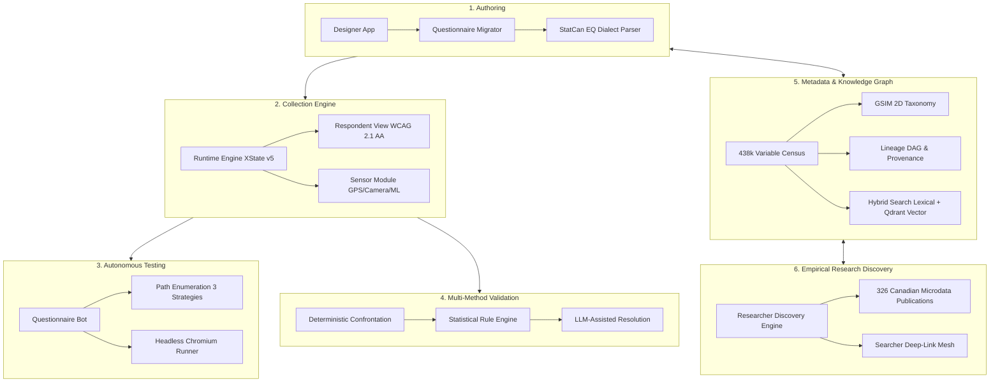

# mobilesurvey Platform Dossier & Evidence Compendium

> **Comprehensive documentation, design decisions, audit evidence, reproducible pipelines, and presentation assets for the modularsurvey platform.**  
> *Last updated: October 2026*

---

## 1. Executive Overview

**mobilesurvey** (`msurvey.peji.ca`) is an end-to-end, standards-compliant, modular survey and metadata infrastructure engineered for official statistics agencies, survey methodologists, and empirical social researchers.

Rather than building a monolithic questionnaire web application, mobilesurvey is decomposed into **six decoupled, interoperable capabilities**:

---

## 2. Dossier Structure

This dossier contains detailed architectural rationales, audit reports, reproducible CLI runbooks, and presentation materials:

1. **[`01-MODULAR-TOOLS-ARCHITECTURE.md`](./01-MODULAR-TOOLS-ARCHITECTURE.md)**  
   *Deep dive into each of the 6 core pillars, boundary contracts, DDI-Lifecycle alignment, state machine architectures, and runtime engine isolation.*
2. **[`02-DESIGN-DECISIONS-AND-EVALUATION.md`](./02-DESIGN-DECISIONS-AND-EVALUATION.md)**  
   *The "Why" behind every major technical trade-off: Relational DAG vs Graph DBs, Lexical baseline vs Vector sidecar, survey boilerplate stripping (+27% similarity gain), acronym guardrails, and smart battery stitching.*
3. **[`03-TRI-LENS-AUDIT-AND-REMEDIATION-LOG.md`](./03-TRI-LENS-AUDIT-AND-REMEDIATION-LOG.md)**  
   *Forensic reports from the Content SME, Metadata Standards Expert, and External Researcher multi-agent audit team. Details the 497 unsuppressed variables, leaking weight suppression, 28 academic search aliases, and before/after verification.*
4. **[`04-REPRODUCIBLE-PIPELINE-RUNBOOK.md`](./04-REPRODUCIBLE-PIPELINE-RUNBOOK.md)**  
   *Complete CLI instructions to reproduce the entire data pipeline: dictionary ingestion, classification, vector embedding in Qdrant Cloud, role synchronization, AI concept staging, and benchmark test suites.*
5. **[`05-EXECUTIVE-PRESENTATION-DECK.md`](./05-EXECUTIVE-PRESENTATION-DECK.md)**  
   *A 10-slide executive presentation deck with slide layouts, speaking notes, architecture callouts, and key empirical metrics for briefings with statistical agencies, academic departments, or technology stakeholders.*

---

## 3. Core Vital Statistics

* **Variables Indexed**: 438,931 variable entries classified across 113 survey programs and 260 cycles.
* **Vector Index**: 179,592 substantive English variable occurrences in Qdrant Cloud (`modularsurvey`), 384-d Cosine embeddings with 0 role mismatches.
* **Search Performance**: Sub-second full-text & semantic retrieval (P50: 308 ms lexical, 189 ms vector sidecar).
* **Research Mesh**: 326 catalogued outside peer-reviewed articles and Canadian policy reports mapped to 8 major StatCan microdata programs (CCHS, GSS, LFS, CHMS, SHS, CSD, CIS, CIUS).
* **Code Standards**: Strict TypeScript across 16 workspace packages, 0 `eval()` calls, WCAG 2.1 AA accessibility, and DDI-CDI cross-cycle variable continuity.
